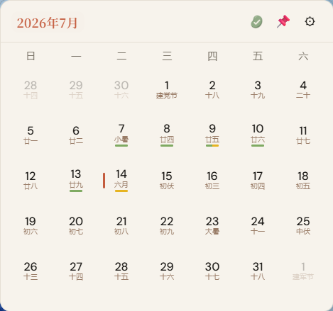
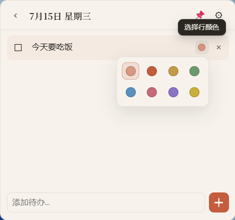
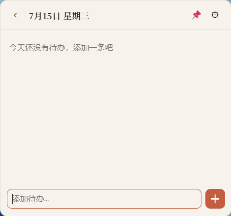

<div align="center">

# CanDo · 蚕豆

**Put your calendar and todos gently on the desktop.**

<br />

[](./src/lib/version.ts)
[](#)
[](https://github.com/Grinfly/desktop-calendar-widget)
[](https://tauri.app)
[](https://react.dev)

**English** | **[简体中文](./README.zh-CN.md)**

</div>

---

**CanDo（蚕豆）** is a lightweight Windows desktop widget that combines a calendar with a daily todo list. The name plays on *Calendar + Todo* — and sounds like *Can Do* in Chinese (*candou*, broad bean).

Small, translucent, and pin-able — see the date and what you need to do today at a glance. Lunar dates, solar terms, and festivals are an optional extension.

## Features

| Module | Description |
|--------|-------------|
| Month view | Gregorian calendar; install the lunar extension for lunar dates, solar terms, and festivals |
| Task progress | Colored bar under the date: yellow = pending, green = done, split by ratio |
| Daily todos | Add, check off, edit, delete; row colors and expandable long text |
| Pin modes | Floating (always on top) / Desktop (release always-on-top) |
| Transparency | Adjustable background opacity 20%–100% in Settings |
| System tray | Show / hide, switch pin mode, quit |
| Local storage | Data saved to `%APPDATA%/desktop-calendar-widget/data.json` |
| Extensions | Install `.cando-ext` packages from Settings; unused features stay out of the app |

## Screenshots

<p align="center">
  <table>
    <tr>
      <td align="center"></td>
      <td align="center"></td>
      <td align="center"></td>
    </tr>
  </table>
</p>

<p align="center">
  <sub>Month view · Daily todos with row colors · Add a new task</sub>
</p>

## Requirements

- Windows 10 / 11
- Node.js 18+
- Rust (MSVC toolchain)
- Visual Studio 2022 C++ Build Tools
- Windows 10 SDK
- WebView2 (usually pre-installed)

## Development

```bash
git clone https://github.com/Grinfly/desktop-calendar-widget.git
cd desktop-calendar-widget
npm install
npm run tauri dev
```

If linking fails under Git Bash, use:

```bash
scripts/build-windows.bat
```

## Build

```bash
scripts/build-windows.bat
```

Installer output: `src-tauri/target/release/bundle/`

## Extensions

The main app does not include the lunar calendar. Build and install the extension package separately:

```bash
npm run build:ext:lunar
```

Output: `dist-extensions/lunar.cando-ext`. Open Settings → Install extension and pick that file. Uninstalling removes `%APPDATA%/desktop-calendar-widget/extensions/<id>/`.

## Tech Stack

- **Frontend**: React 19 · TypeScript · Vite
- **Desktop**: Tauri 2
- **Calendar**: date-fns; the lunar extension uses lunar-javascript

## Branding

App icon and brand board live in [`branding/`](./branding/).

---

<div align="center">

**CanDo · 蚕豆** — Stay light. Stay on top of your day.

</div>
