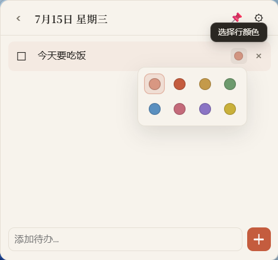

<div align="center">

# 蚕豆 · CanDo

**把日历和待办，轻轻放在桌面上。**

<br />

[](./src/lib/version.ts)
[](#)
[](https://github.com/Grinfly/desktop-calendar-widget)
[](https://tauri.app)
[](https://react.dev)

**[English](./README.md)** | **简体中文**

</div>

---

**蚕豆（CanDo）** 是一款 Windows 桌面日历待办小组件。名字来自「Calendar + Todo」，谐音 Can Do / 蚕豆——能办、好记。

小巧、透明、可钉在桌面上，帮你一眼看到日期、农历和今天要做什么。

## 功能亮点

| 模块 | 说明 |
|------|------|
| 月历视图 | 公历月历，每日显示农历 / 节气 / 节日 |
| 待办进度 | 农历下方彩色横线：黄色=未完成，绿色=已完成，按比例分段 |
| 当日待办 | 添加、勾选、编辑、删除；支持行颜色与长文本展开 |
| 钉住模式 | 悬浮置顶 / 贴到桌面（关闭置顶，融入壁纸层） |
| 透明背景 | 设置中调节不透明度 20%–100% |
| 系统托盘 | 显示 / 隐藏、切换钉住、退出 |
| 本地存储 | 数据保存在 `%APPDATA%/desktop-calendar-widget/data.json` |

## 截图

<p align="center">
  <table>
    <tr>
      <td align="center"></td>
      <td align="center"></td>
      <td align="center"></td>
    </tr>
  </table>
</p>

<p align="center">
  <sub>月历视图 · 待办与行颜色 · 添加待办</sub>
</p>

## 环境要求

- Windows 10 / 11
- Node.js 18+
- Rust（MSVC toolchain）
- Visual Studio 2022 C++ 工具链
- Windows 10 SDK
- WebView2（通常已预装）

## 开发

```bash
git clone https://github.com/Grinfly/desktop-calendar-widget.git
cd desktop-calendar-widget
npm install
npm run tauri dev
```

若 Git Bash 下 Rust 链接失败，请使用：

```bash
scripts/build-windows.bat
```

## 打包

```bash
scripts/build-windows.bat
```

安装包输出目录：`src-tauri/target/release/bundle/`

## 技术栈

- **前端**：React 19 · TypeScript · Vite
- **桌面**：Tauri 2
- **日期**：date-fns · lunar-javascript（农历 / 节气 / 节日）

## 品牌资源

图标与品牌预览见 [`branding/`](./branding/) 目录。

---

<div align="center">

**蚕豆 · CanDo** — 轻量桌面，把今天看清楚。

</div>
